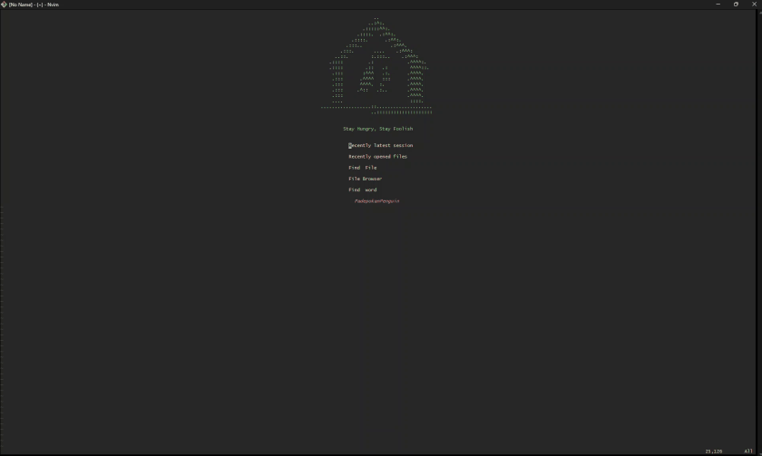

# dotvim

Personal Neovim configuration, kept up to date with the current Neovim APIs and
the maintained upstream of every plugin it uses.

## Preview

[](assets/demo/nvim.mp4)

<sub>Click the preview above to open the full video demonstration (`assets/demo/nvim.mp4`).</sub>

## Requirements

| Tool | Why |
| --- | --- |
| Neovim **0.12+** | `nvim-treesitter` (`main` branch) and native `vim.lsp.config` |
| `git` | plugin installation |
| `tree-sitter` CLI **>= 0.26.1** | building tree-sitter parsers (not the npm package) |
| C compiler (`build-essential` / `gcc`) | compiling parsers |
| `ripgrep`, `fd` | Telescope (`fd` is `fdfind` on Debian/Ubuntu) |
| `node` + `npm` | language servers installed through Mason |
| Go toolchain | `gopls` and `gofumpt` (installed via Mason) |
| .NET SDK (8.0+) | `csharp-ls` and `csharpier` (installed via Mason) |
| `xclip` (or `wl-clipboard`) | `clipboard=unnamedplus` |
| `prettierd` | formatting of web filetypes via none-ls |

On Ubuntu 24.04 the packages above come from `apt`, except Neovim (use the
official release tarball) and `tree-sitter` (use the official CLI release).

## Installation

```sh
git clone https://github.com/padepokanpenguin/dotvim.git ~/.config/nvim
nvim --headless "+Lazy! sync" +qa        # installs plugins
```

`lazy.nvim` bootstraps itself on first start, so no manual plugin-manager step
is needed. Tree-sitter parsers listed in `after/plugin/treesitter.rc.lua` are
installed automatically on the first start (or manually with `:TSInstall lua
json css html php tsx`; the `main` branch has no `TSInstallSync`).

## Layout

```
init.lua                     entry point: options, keymaps, lazy.nvim bootstrap
lua/base.lua                 editor options
lua/maps.lua                 global keymaps
lua/plugins.lua              plugin specifications (lazy.nvim)
lsp/*.lua                    per-server LSP settings (vim.lsp.config)
plugin/*.rc.lua              configuration sourced at startup
after/plugin/*.rc.lua        configuration sourced after all plugins load
```

## Language support

| Language | Server | Formatter | Parser |
| --- | --- | --- | --- |
| TypeScript / JavaScript | `ts_ls` | `prettierd` | `tsx`, `typescript` |
| Tailwind CSS | `tailwindcss` | `prettierd` | `css` |
| PHP / HTML / JSON | `typos_lsp` | `prettierd` | `php`, `html`, `json` |
| Lua | `lua_ls` | — | `lua` |
| **C# (.NET)** | `csharp_ls` | `csharpier` | `c_sharp` |
| **Go** | `gopls` | `gofumpt` | `go` |
| **Python** | `basedpyright` | `ruff` (`ruff format`) | `python` |

Servers are installed by `mason-lspconfig` and formatters by
`mason-tool-installer`; per-server settings live in `lsp/<server>.lua`.

`snyk_ls` (Snyk security scanner) is installed but **not started by default**:
it needs an authenticated account and otherwise only reports
`Auth initializer failed to authenticate`. Export `SNYK_TOKEN` and it is enabled
automatically.

## Security scanning

Snyk is account-gated, so the config uses two scanners that need no account:

| Tool | What it catches | Source |
| --- | --- | --- |
| **semgrep** | static analysis (SAST) — `eval`, `subprocess(shell=True)`, injection patterns, … | `null-ls.builtins.diagnostics.semgrep` with `--config auto` |
| **gitleaks** | hardcoded secrets and credentials | `null-ls.builtins.diagnostics.gitleaks` |

Both are installed by `mason-tool-installer` and run on the filetypes where they
make sense (semgrep: code languages; gitleaks: code + config/env files).

Two settings worth knowing:

- semgrep's `--config auto` fetches the curated registry ruleset on first use
  (network required once, then cached).
- none-ls kills a generator after **5 s** by default and a semgrep run takes
  ~5 s even warm, so the semgrep source overrides `timeout` (60 s); gitleaks
  gets 10 s.

## Design notes

- **Plugin manager**: `lazy.nvim`. `packer.nvim` was replaced (archived
  upstream). All specs are loaded eagerly because this config styles itself
  from `plugin/` and `after/plugin/` files.
- **LSP**: native Neovim API — servers are declared in `lsp/*.lua` and enabled
  by `mason-lspconfig.nvim`. The deprecated `require('lspconfig')` framework and
  `vim.lsp.diagnostic.on_publish_diagnostics` handler are no longer used.
- **Treesitter**: `nvim-treesitter` `main` branch. The plugin only manages
  parsers; highlighting and indentation are started by Neovim in
  `after/plugin/treesitter.rc.lua`.
- **Formatting**: `none-ls.nvim` (maintained fork of `null-ls.nvim`) runs
  `prettierd`; the separate `prettier.nvim` plugin is no longer needed.
